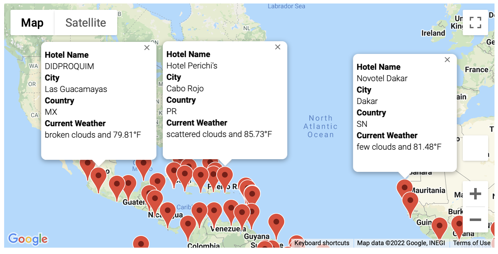
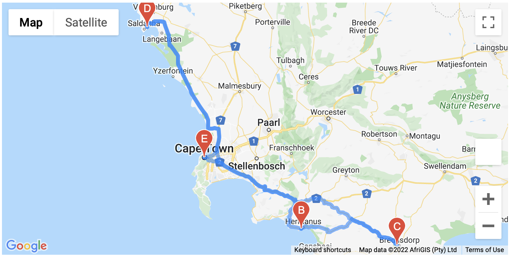
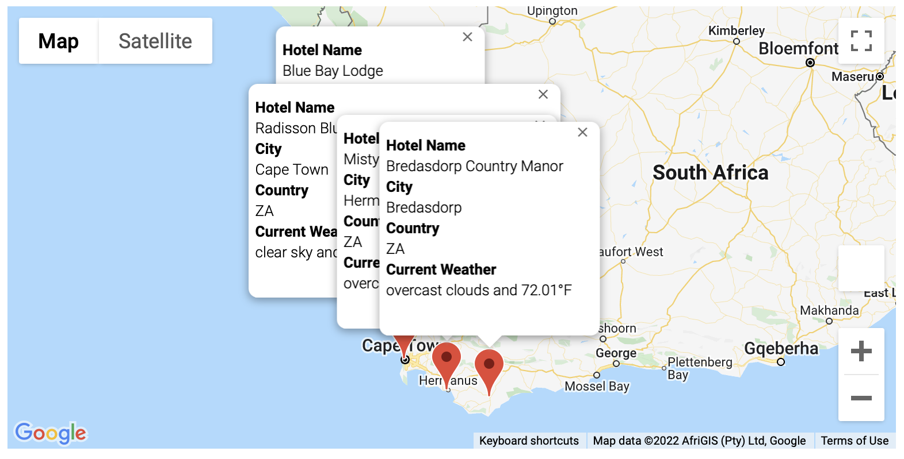

# World Weather Analysis
## Overview
In this project we pulled large amount of data from Open Weather Map and Google Maps using API calls in order to create maps with heat layers for weather specificstions, marker layers with info boxes, and directiond layers for travel.

### Purpose 
The purpose of this project was to create an app where customers can choose a vacation destination depending on their specific weather choice.

## Results 
We first created a weather database where we created a list of coordinates and used those coordinates to find nearby cities. then we cunducted API calls to Open Weather Map for each of those cities to find the current weather description. Next we created a dataframe converted it into a CSV file and exported it to our folder for later use.


```
# Create a set of random latitude and longitude combinations
lats = np.random.uniform(low=-90.000, high=90.000, size=2000)
lngs = np.random.uniform(low=-180.000, high=180.000, size=2000)
coordinates = list(lat_lngs)
```
```
city_url = url + "&q=" + city.replace(" ", "+")
city_weather = requests.get(city_url).json()
```
```
# Run an API request for each of the cities.
    try:
        # Parse the JSON and retrieve data.
        city_weather = requests.get(city_url).json()
        # Parse out the needed data.
        city_lat = city_weather["coord"]["lat"]
        city_lng = city_weather["coord"]["lon"]
        city_max_temp = city_weather["main"]["temp_max"]
        city_humidity = city_weather["main"]["humidity"]
        city_clouds = city_weather["clouds"]["all"]
        city_wind = city_weather["wind"]["speed"]
        city_country = city_weather["sys"]["country"]
        city_description = city_weather["weather"][0]["description"]
        # Append the city information into city_data list.
        city_data.append({"City": city.title(),
                          "Lat": city_lat,
                          "Lng": city_lng,
                          "Max Temp": city_max_temp,
                          "Humidity": city_humidity,
                          "Cloudiness": city_clouds,
                          "Wind Speed": city_wind,
                          "Country": city_country,
                          "Current Description": city_description})

# If an error is experienced, skip the city.
    except:
        print("City not found. Skipping...")
        pass
```


We then used th CSV file we created and used it to create a new DataFrame with available hotels in the chosen cities. This DataFrame was also converted into another CSV file to use later on. Next we added an input box for the customer to input their desired temperature range for their vacation. Then we produced a map with markers and infor boxes where the customer can choose their desired destination.

```
# Get the maximum temperature.
max_temp = city_data_df["Max Temp"]
temps = []
for temp in max_temp:
    temps.append(max(temp, 0))

# Ask the customer to add a minimum and maximum temperature value.
min_temp = float(input("What is the minimum temperature you would like for your trip? "))
max_temp = float(input("What is the maximum temperature you would like for your trip? "))
```
```
# 3. Filter the city_data_df DataFrame using the input statements to create a new DataFrame using the loc method.
preferred_cities_df = city_data_df.loc[(city_data_df["Max Temp"] <= max_temp) & \
                                       (city_data_df["Max Temp"] >= min_temp)]

```


Finally we used the CSV file we created in the last section to locate four specific cities near each other a customer might want to visit in one trip and created a map with both marker layers containing info boxes and direction layers to view how the path between the cities. 
```
# 5. Create DataFrames for each city by filtering the 'vacation_df' using the loc method.
 vacation_start = vacation_df.loc[(vacation_df["City"] == "Cape Town")]
vacation_end = vacation_df.loc[(vacation_df["City"] == "Cape Town")]
vacation_stop1 = vacation_df.loc[(vacation_df["City"] == "Hermanus")]
vacation_stop2 = vacation_df.loc[(vacation_df["City"] == "Bredasdorp")]
vacation_stop3 = vacation_df.loc[(vacation_df["City"] == "Saldanha")]
```
```
# 6. Get the latitude-longitude pairs as tuples from each city DataFrame using the to_numpy function and list indexing.
start = vacation_start.to_numpy()[0][5], vacation_start.to_numpy()[0][6]
end = vacation_end.to_numpy()[0][5], vacation_end.to_numpy()[0][6]
stop1 = vacation_stop1.to_numpy()[0][5], vacation_stop1.to_numpy()[0][6]
stop2 = vacation_stop2.to_numpy()[0][5], vacation_stop2.to_numpy()[0][6]
stop3 = vacation_stop3.to_numpy()[0][5], vacation_stop3.to_numpy()[0][6]
```



## Summary
From this project we used many diffrent methods such as loc and to_numpy in order to create DateFrames and maps that when used with API call created a useful feature for travel companies websites. This feature would provide a short-cut for customers making it more convinet to use therfor attracting more customers.
